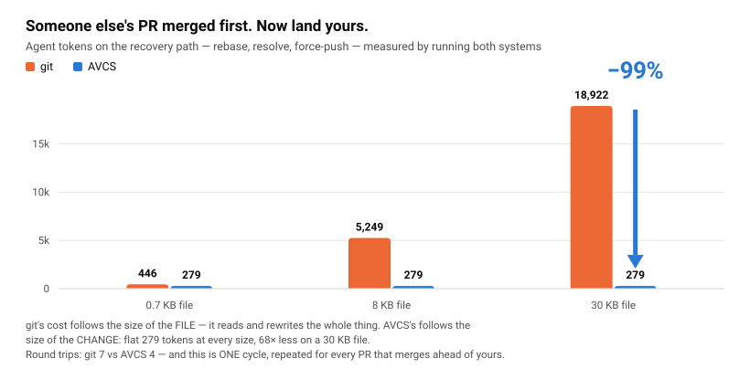

# avcs-demo — two agents, one file, no conflict markers

A small, **runnable** demo of [AVCS](https://github.com/izagood/avcs) (`@izagood/avcs`),
the AI-native version control system. It answers one question, end to end, on your machine:

> **What happens when two agents edit the same file at the same time —
> and what does each answer cost you in tokens?**

In git, the second writer meets `! [rejected] — fetch first`, then a rebase, and — if the
edits touch the same lines — `<<<<<<<` markers dumped into the file. In AVCS the second
writer's stale head is absorbed by the hub, disjoint edits **auto-merge deterministically**,
and a genuine collision becomes a **first-class conflict object** that a human resolves by
recording a **signed decision** — the rationale stays in history forever.

| | git | AVCS |
|---|---|---|
| second push on a stale head | rejected — pull, rebase, retry | absorbed — `land` re-reduces on the hub |
| same file, different lines | often fine, sometimes markers | **L0/L1 auto-merge**, guaranteed deterministic |
| same file, same line | `<<<<<<<` markers in your code | **conflict object** + options, file stays clean |
| how it's resolved | someone edits bytes; the why evaporates | signed `decision` (chosen op, rejected op, reason) |
| what blame says | who + commit message | who + **declared purpose + intent** |

## Run it

Prerequisites: **Node ≥ 22.6** and `npm` (plus `curl`, used to wait for the local hub).

```bash
git clone <this-repo> && cd avcs-demo
./demo.sh
```

That's it. The script installs the published `@izagood/avcs` release locally, then runs the
whole scenario inside `./sandbox/` — a directory it wipes and recreates on every run. Your
real `~/.avcs` keystore is never touched (the demo isolates `AVCS_CONFIG_HOME`), and nothing
talks to the network except `npm install` and a hub on `127.0.0.1`.

## What you'll watch happen

**Act 1 — a repo on your disk is a complete VCS.** `avcs init` + `avcs import` over a tiny
todo module, one edit recorded with `avcs commit` — which authors semantic *operations*, not
a git commit — then `avcs log` and `avcs blame file:src/todo.js`. Blame answers *who owns
this file and why*: the declared purpose travels with the operation.

**Act 2 — concurrent edits, different places → auto-merge.** A hub (`avcs serve`) and two
clones, `alice` and `bob`. Alice edits the top of `src/todo.js` and lands. Bob — whose clone
has **not** seen alice's change — appends at the bottom and lands on a now-stale head.
No "fetch first", no rebase: both lands succeed, and the merged file contains both edits.
The log shows the two operations as concurrent siblings sharing one sequence number.

**Act 3 — concurrent edits, same line → a decision, not markers.** Both clones reword the
same `throw new Error(...)` line differently. Alice lands; bob's land is refused with a
**conflict packet** (this is L2 in AVCS's conflict grading — overlapping line regions).
`avcs conflicts` shows the conflict as an object listing both operations. A human records a
signed decision choosing bob's wording (`avcs decide <conflict-id> --choose <op-oid>`, the
CLI counterpart of the MCP tool `avcs.decision.record`), bob's land goes through, and `avcs show
<decision>` prints the ed25519-signed decision — chosen op, rejected op, and the reason.

Run it twice: the sandbox is rebuilt from scratch each time, so the outcome is reproducible.

## What it costs an agent in tokens

The table above is about correctness. This one is about the bill — and the bill is
**37–99% smaller**, measured. When an agent's push races with someone else's, git makes it
**recover**: read the rejection, rebase, and — if the edits collided — pull the entire
conflicted file into context and write the entire file back. AVCS either absorbs the race or
hands back a small object describing it. On a 30 KB module that is **18,922 tokens versus
279 — a 99% saving on the single most common interruption in a team's day.**

<picture>
  <source media="(prefers-color-scheme: dark)" srcset="docs/rebase-token-cost-dark.svg">
  
</picture>

`node tools/token-cost.mjs` measures this by **running both systems for real** and counting
the bytes each forces the agent to read and write, plus the round trips it takes. Measured
on this machine, at 4 bytes/token:

| file under contention | scenario | git | AVCS | saved | git trips | AVCS trips |
|---|---|---:|---:|---:|---:|---:|
| 0.7 KB | disjoint edits | 149 tok | 20 tok | **87%** | 3 | 1 |
| 8 KB | disjoint edits | 149 tok | 20 tok | **87%** | 3 | 1 |
| 30 KB | disjoint edits | 149 tok | 20 tok | **87%** | 3 | 1 |
| 0.7 KB | same-line collision | 581 tok | 292 tok | **50%** | 6 | 4 |
| 8 KB | same-line collision | 5,384 tok | 292 tok | **95%** | 6 | 4 |
| 30 KB | same-line collision | 19,057 tok | 292 tok | **98%** | 6 | 4 |
| 0.7 KB | open PR, base moved | 446 tok | 279 tok | **37%** | 7 | 4 |
| 8 KB | open PR, base moved | 5,249 tok | 279 tok | **95%** | 7 | 4 |
| 30 KB | open PR, base moved | 18,922 tok | 279 tok | **99%** | 7 | 4 |

**"open PR, base moved" is the one that happens to you every day.** Your branch has been
open a while; someone else's PR merges first; now yours must be rebased onto the moved base
and **force-pushed**, which restarts CI on the PR. That is the most expensive row in git —
7 round trips, and the whole file read and rewritten once per rebase round the replay
stops at. AVCS has no branch to rewrite and nothing to force-push: bob's three operations
are already history, and `land` submits them to the hub, which re-reduces the moved frontier
on his behalf. **This row is one cycle. It repeats every time another PR merges ahead of
yours** — three merges while your PR sits means three rebases in git, and nothing extra in
AVCS.

**The shape matters more than any single number.** git's recovery cost grows with the size
of the *file*, because a conflict is bytes inside it — the agent reads 30 KB and writes 30 KB
to change one line. AVCS's cost is flat at ~280 tokens across every file size, because the
conflict is an object naming the two contending operations. Put a real 30 KB module under
two agents and git charges you **65–68× more tokens** for the same landing.

**Round trips are the larger bill.** Every extra turn re-sends the live conversation, so a
turn costs roughly the context size, not the size of the output that caused it. At 40 KB of
context, git's 3 trips vs AVCS's 1 in the common disjoint case is **30,869 vs 10,260 tokens
— 67% saved on the case that happens most often**, and the open-PR rebase on a 30 KB file is
**90,602 vs 41,239 — 54% saved**. Run
`node tools/token-cost.mjs --context-kb 120` to price it against your own context budget.

<details>
<summary>What is and isn't counted</summary>

Counted, identically for both: command output the agent must read, file bytes it must read
to resolve, file bytes it must write back, and round trips. Not counted for either:
authoring the change (same in both worlds), running tests (same in both worlds), and the
agent's own reasoning tokens (not observable from outside — they favor AVCS, since a
conflict packet is a smaller thing to think about than a marked-up file).

The same-line row is **not the same act** in both systems: in git the agent resolves the
collision alone; in AVCS it may not — it surfaces the options and a human signs the
decision. The tokens a wrong silent git resolution costs later are not counted here either.
The human's `decide` command is excluded from AVCS's total, because counting a human
keystroke as an agent token would flatter AVCS.

The open-PR row counts **one** rebase cycle, and the harness counts the conflict rounds git
actually reported (shown as `rounds g/a` in the output) rather than assuming a number. Real
branches often hit more, and each merged PR ahead of yours starts another cycle.

The harness refuses to report a number unless both systems actually reached a landed state
with the change intact — a refused command is cheap too, and measuring failure as
efficiency is the easiest way to get a flattering graph.
</details>

## The same workflow, driven by an AI agent

`demo.sh` plays both humans. The intended driver of AVCS is an **agent over MCP** — 36 tools
(13 with `--profile core`), where the agent proposes operations instead of writing files,
attaches machine-checkable evidence, and lands work in one call:

```bash
npm install -g @izagood/avcs
avcs mcp install        # registers the MCP server with the Claude Code CLI
```

**[agent-session.md](agent-session.md)** is a session-record walkthrough of the same todo
project driven from Claude Code: the canonical 9-step loop (intent → session → context →
lease → propose → validate → evidence → materialize → land), and what the conflict from
Act 3 looks like when an *agent* hits it — including why the agent cannot resolve it alone.

## Repository map

| Path | What it is |
|---|---|
| `demo.sh` | The whole demo — annotated, idempotent, runs against the published release |
| `src/todo.js`, `src/format.js` | The example project: a tiny working todo module |
| `test/todo.test.js` | Its tests (`npm test`) — the kind of evidence AVCS gates merges on |
| `tools/token-cost.mjs` | Runs both git and AVCS for real and measures the agent tokens each costs |
| `tools/make-chart.mjs` | Draws the chart above **from** `docs/measurements.json`, so picture and numbers cannot drift |
| `agent-session.md` | The same workflow as an MCP agent session transcript |
| `sandbox/` | Created by `demo.sh`, git-ignored, safe to delete |

## Learn more

- [AVCS repository](https://github.com/izagood/avcs) — design docs, roadmap, issue templates
- [Agent quickstart](https://github.com/izagood/avcs/blob/main/docs/25-agent-quickstart.md) — the MCP loop this demo's `agent-session.md` follows
- Conflict levels, the reducer, and why merge is a deterministic reduction: [docs/03-reducer.md](https://github.com/izagood/avcs/blob/main/docs/03-reducer.md)

## License

Apache-2.0, same as AVCS.
